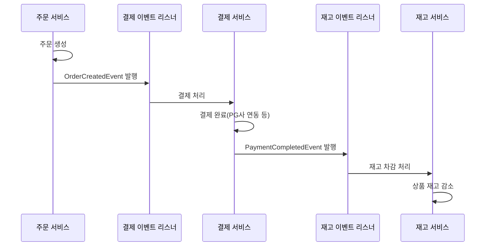

# 3주차 이벤트 리스너 기반 이벤트 처리

1. 이벤트 플로우 다이어그램



2. 실행 방법

order 빌드
```
./gradlew :practice-order:build
```

order test
```
./gradlew :practice-order:test
```
OrderServiceTest, AsyncEventTest, OrderFlowIntegrationTest, TransactionalEventTest를 따로 실행하셔도 됩니다.

3. 프로젝트 구조 (축약)
```
practice-order
├── build.gradle
├── gradle
│   └── wrapper
│       ├── gradle-wrapper.jar
│       └── gradle-wrapper.properties
├── gradlew
├── gradlew.bat
├── settings.gradle
└── src
    ├── main
    │   ├── java
    │   │   └── com
    │   │       └── sparta
    │   │           └── practiceorder
    │   │               ├── common
    │   │               │   ├── AsyncConfig.java
    │   │               │   ├── AsyncTransactionalEventListener.java
    │   │               │   ├── BaseEvent.java
    │   │               │   └── EventPublisher.java
    │   │               ├── order
    │   │               │   ├── domain
    │   │               │   │   ├── enums
    │   │               │   │   │   └── OrderStatus.java
    │   │               │   │   └── Order.java
    │   │               │   ├── dto
    │   │               │   │   ├── OrderCreateRequest.java
    │   │               │   │   └── OrderResponse.java
    │   │               │   ├── event
    │   │               │   │   ├── OrderCreatedEvent.java
    │   │               │   │   └── OrderEventListener.java
    │   │               │   ├── repository
    │   │               │   │   └── OrderRepository.java
    │   │               │   └── service
    │   │               │       └── OrderService.java
    │   │               ├── payment
    │   │               │   ├── domain
    │   │               │   │   ├── enums
    │   │               │   │   │   └── PaymentStatus.java
    │   │               │   │   └── Payment.java
    │   │               │   ├── event
    │   │               │   │   ├── PaymentCompletedEvent.java
    │   │               │   │   └── PaymentEventListener.java
    │   │               │   ├── repository
    │   │               │   │   └── PaymentRepository.java
    │   │               │   └── service
    │   │               │       └── PaymentService.java
    │   │               ├── PracticeOrderApplication.java
    │   │               └── stock
    │   │                   ├── domain
    │   │                   │   └── Product.java
    │   │                   ├── event
    │   │                   │   └── StockEventListener.java
    │   │                   ├── repository
    │   │                   │   └── ProductRepository.java
    │   │                   └── service
    │   │                       └── StockService.java
    │   └── resources
    │       └── application.yml
    └── test
        ├── java
        │   └── com
        │       └── sparta
        │           └── practiceorder
        │               ├── AsyncEventTest.java
        │               ├── OrderFlowIntegrationTest.java
        │               ├── service
        │               │   └── OrderServiceTest.java
        │               └── TransactionalEventTest.java
        └── resources
            └── application.yml
```
4. 이벤트 가이드
- 과거형 사용: OrderCreated, PaymentCompleted
- 형식: {Domain}{Action}Event

5. 회고
- 송의현: 비동기관련 테스트는 조건제한을 엄격하게 검토하고 각 스레드별 대기 시간등 제약을 두어야 다른 테스트에 영향을 주지 않는다는 걸 알게되었고
  트랜잭션의 경계에 대해서 다시 생각해 보게 되었으며
  별도의 스레드에서 작업을 하게 되면 메인스레드에서 예외가 발생되어도 영향이 미치지 않는다는 지식을 얻게 되었다.이벤트와 메서드의 차이에 대해 명확히 알게 되었고 어떤 상황에서 써야하는지 이벤트의 페이로드에는 어떤 정보가 담겨야하는지 배우게되는 과제였습니다

- 윤혜지: 이번 3주차 세션을 통해 Step 1~5까지 세세하게 따라가며 이벤트 처리에 대한 이해도를 높일 수 있었습니다. 또한, 과제를 수행하면서 이벤트를 활용해 결합도를 낮추는 개선 방법을 직접 경험할 수 있어 매우 유익했습니다.
  트랜잭션이 커밋될 때 이벤트를 발행하는 방식이라던가, 비동기 이벤트 처리의 흐름을 학습하며 실무에서의 활용 가능성을 직접 느낄 수 있었습니다. 이번 경험을 통해 이벤트 기반 설계의 장점과 주의해야 할 점을 더 깊이 이해하게 되었고, 앞으로 프로젝트에 적용할 때 좀 더 자신 있게 설계를 고민할 수 있을 것 같습니다.

- 안지현: 이번에 따로 허브 생성에 이벤트 구조를 적용하면서 도메인 책임 분리랑 비동기 후처리 흐름을 직접 이해할 수 있었다. 허브 생성과 기본 라우팅 생성을 각각 이벤트로 나누니까 코드가 훨씬 깔끔해지고 확장 가능해지는 느낌을 받았다.

- 류형선: 기본적인 이벤트 발행, 이벤트 리스너, 비동기 설정, 진행 흐름들에 대해 이해할 수 있는 시간이였다. 특히 이벤트에서 트랜젝션의 중요성에 대해 깊이 체감할 수 있었으며, 트랜젝션 흐름과 경계에 대해 공부할 수 있었다.

- 유영우:
  이전에는 스케줄러 기반 방식으로 주문 결제 흐름을 구현했었는데, 이번에 이벤트 기반으로 다시 설계해보면서 전체 구조가 훨씬 단순해지고 가독성도 좋아졌다고 느꼈습니다.
특히 종속 관계를 API 호출로 직접 연결하는 방식은 자연스럽게 결합도를 높였는데, 이벤트 기반으로 전환하면서 각 도메인이 느슨하게 연결되고 역할이 명확하게 분리된 점이 가장 만족스러웠습니다.
이벤트를 한 번 발행하면 여러 도메인이 이를 구독하여 자신들의 흐름을 이어갈 수 있다는 점도 매우 유용했습니다.
  어려웠던 부분
    * 비동기 테스트
비동기 이벤트를 테스트할 때 어떤 방식으로 검증해야 할지 고민이 많았습니다. 단순 동기 테스트처럼 즉시 검증할 수 없기 때문에, 비동기 테스트 전략을 더 공부하고 정리할 필요성을 느꼈습니다.
    * 예외 및 실패 처리 흐름 설계
정상 시나리오의 이벤트 발행과 흐름 구성은 어렵지 않았지만, 예외 상황이나 예기치 못한 실패를 어떻게 통일된 방식으로 처리할지 고민이 가장 컸습니다.
특히 실패 시 “일관성 있게 실패를 다루는 구조”를 만드려면 많이 고민이 필요하다는 것을 느꼈습니다.

6. 질문
- 추상 이벤트 리스너를 적용했을때 각 이벤트 별로 다른 설정을 적용하고 싶으면 어떻게 해야할지
