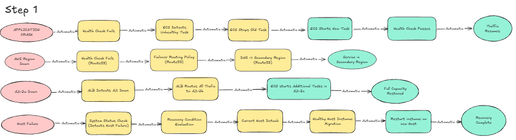

아래는 **GitHub Markdown 렌더링 기준으로 가장 깔끔하게 보이도록** 전체 섹션을 재배치·정렬·문단 간격·구분선·헤더 깊이를 모두 조정한 최적화 버전입니다.

GitHub README에서 **제목·표·리스트·구분선이 다 예쁘게 보이도록** 튜닝했습니다.

---

# 시스템 요구사항 정리

## 요구사항 및 기술 대응 요약

| 이름               | 요구사항                         | 기술 대응                                    |
| ---------------- | ---------------------------- | ---------------------------------------- |
| **운영 팀 (김철수)**   | 시스템이 스스로 복구되어야 함             | 자동 복구(Auto Healing)                      |
| **비즈니스 팀 (박영희)** | 필요할 때만 서버를 자동으로 늘렸다 줄여 비용 절감 | Auto Scaling                             |
| **보안 팀 (최민수)**   | DB는 외부에서 절대 직접 접근 불가         | VPC Private Subnet, IAM Role, CloudTrail |
| **재무 팀 (정수진)**   | 인프라 비용 월 15만원 제한             | 비용 최적화 설계                                |
| **CTO (이동혁)**    | SLA 준수 및 업계 표준 아키텍처 필요       | Task Definition 최적화, ALB→Backend→DB 구성   |

---

## 1. 운영 요구사항

서비스 장애 발생 시 자동 복구 및 신속 대응을 목표로 한다.

### 기술 요구사항

* **서비스 자동 복구**

    * ECS/ALB Health Check → 비정상 Task 자동 재시작
    * RDS Multi-AZ → 자동 Failover
    * EC2 장애 → ASG로 자동 교체
* **장애 감지 및 알림**

    * CloudWatch Alarms 기반 실시간 감지

---

## 2. 개발 요구사항

무중단 배포 및 빠른 로그 확인, 즉시 롤백 가능한 환경 제공.

### 기술 요구사항

* **무중단 배포**: Rolling / Blue-Green
* **로그 통합 관리**: CloudWatch Logs
* **즉시 롤백**: Task Definition Revision 기반

---

## 3. 비즈니스 요구사항

확장성 + 비용 효율성을 동시에 충족.

### 기술 요구사항

* **확장성 확보**: Auto Scaling, ALB Load Balancing
* **비용 절감**: Scale-In 정책 설정

---

## 4. 보안 요구사항

내부망 보호와 최소 권한 원칙 준수.

### 기술 요구사항

* **네트워크 분리**: Public / Private Subnet
* **DB 보호**: RDS Private Subnet
* **권한 최소화**: SG 정책(ALB→EC2, EC2→RDS)
* **HTTPS 보안**: ALB TLS 인증서 적용

---

## 5. 비용 관리 요구사항

불필요한 비용 발생 방지 및 추적 가능 구조.

### 기술 요구사항

* **비용 절감**: Auto Scaling 기반 수요형 확장
* **로그 비용 절감**: CloudWatch Logs Retention
* **비용 추적**: 태깅 전략

---

# STEP 1: 장애 유형별 자동 복구 가능 여부 및 대응 전략

| 장애 종류            | 발생 원인    | 자동 복구           | 복구 방법                             | 예상 시간 | AWS 기능                         |
| ---------------- | -------- | --------------- | --------------------------------- | ----- | ------------------------------ |
| **App 크래시**      | OOM      | ✅ 가능            | 컨테이너 자동 재시작                       | ~30초  | ECS Health Check               |
| **호스트 하드웨어 장애**  | 물리 서버 오류 | ✅ 가능            | 건강한 서버로 자동 재배치                    | ~3분   | ECS Health Check, Self-Healing |
| **AZ(가용 영역) 장애** | AZ 전체 문제 | ✅ (Multi-AZ 구성) | 정상 AZ로 Failover                   | ~2분   | RDS Multi-AZ, ASG              |
| **리전 장애**        | 리전 전체 문제 | 조건부 가능          | 타 리전으로 우회                         | ~1시간  | Route 53, Cross-Region         |
| **DB 디스크 Full**  | 용량 부족    | ❌ 불가            | Scale-Up / 신규 DB 생성 / Autoscaling | 예측 불가 | CloudWatch + 수동 조치             |

---

# 자동 복구(Auto Healing) — 비기술자용 설명

### 자동 복구란?

장애가 발생해도 시스템이 스스로 문제를 감지하고 정상 상태로 되돌리는 기능.

---

## 애플리케이션 장애

* 상태 점검 → 무응답 감지 → 자동 재기동
* 복구 시간: 약 1분
* 사람 개입: 없음

---

## 서버(호스트) 장애

* 장애 서버 자동 제외
* 정상 서버로 작업 자동 이동
* 물리 장비 문제는 AWS가 처리

---

## 가용 영역(AZ) 장애

* 미리 준비된 다른 AZ로 자동 전환
* 중단 거의 없음

---

## 데이터베이스 장애

* Standby DB로 자동 Failover
* 약 2분 이내 복구

---

## 자동 해결 불가능한 장애

* 코드 버그
* 디스크 Full
* 외부 시스템 장애
* DB 구조 문제

---

# Step 2: 오토 스케일링 정리

## 1. 오토 스케일링 트리거 옵션 비교

| 트리거                    | 설명             | 장점          | 단점              |
| ---------------------- | -------------- | ----------- | --------------- |
| **Target Tracking**    | 목표 지표 기반 자동 조정 | 설정 단순       | 지표가 리소스와 비례해야 함 |
| **Step Scaling**       | 임계값별 단계 확장     | 세밀 제어       | 설정 복잡, 지연 가능    |
| **Simple Scaling**     | 단순 임계 기반 확장    | 매우 쉬움       | 빠른 연속 확장 불가     |
| **Predictive Scaling** | 패턴 기반 사전 확장    | 피크 대비 우수    | 예측 오차·복잡        |
| **Scheduled Scaling**  | 시간 기반 확장       | 패턴 명확 시 효과적 | 예측 불가 패턴엔 무용    |

---

## 2. 3단계 스케일링 전략

| 단계      | 시기      | 목표              | 구현                | 위험 관리           |
| ------- | ------- | --------------- | ----------------- | --------------- |
| **1단계** | 지금(런칭)  | 안정적 시작          | 고정 Task + 수동 조정   | CloudWatch 모니터링 |
| **2단계** | 블프 3일 전 | 10배 트래픽 대비      | 선제적 확장            | 지표 기반 알람        |
| **3단계** | 블프 이후   | 완전 Auto Scaling | CPU/메모리 + 요청 큐 기반 | 실제 데이터 기반 튜닝    |

---

## 3. 권장 Auto Scaling 정책

### A. CPU + 요청 큐 기반

* CPU: 선행 지표
* 요청 큐: 후행 보정 지표
* CPU는 신호, 큐는 확증 역할

### B. 메모리 + 요청 큐 기반

* 요청 증가 → 스레드 증가 → 메모리 상승
* 요청 큐로 실제 부하 여부 확인
* 불필요한 확장 방지

---

## 4. 비즈니스팀 설득 포인트

1. **런칭~블랙프라이데이 전**

    * 오토 스케일링은 예측 불가 동작 위험 → 수동 조정으로 안정 확보

2. **블랙프라이데이 기간**

    * 충분한 실사용 트래픽 데이터 확보

3. **이후 자동 스케일링 도입**

    * 실제 패턴 기반 최적화
    * 불필요한 서버 비용 절감
    * 안정성 + 비용 효율성 두 마리 토끼 확보

---

완료되었습니다.
원하시면 **목차 자동 생성용 스크립트**, **섹션별 배경색 강조 버전**, **PDF 변환용 스타일 가이드**도 만들어 드릴 수 있습니다.

---

