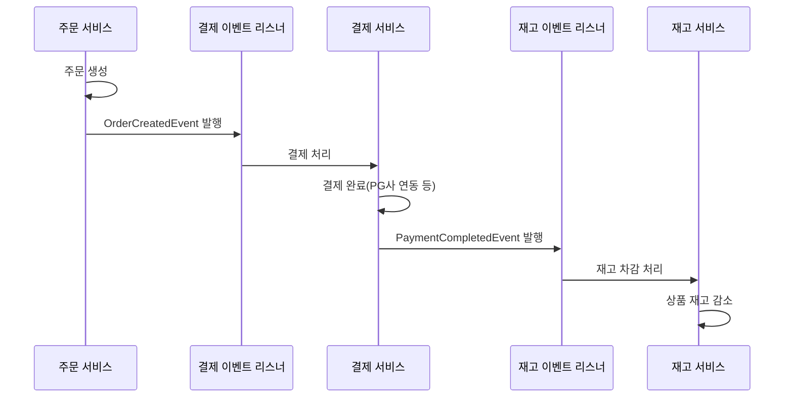

1. 이벤트 플로우 다이어그램



2. 실행 방법

order 빌드
```
./gradlew :order:build
```

order test
```
./gradlew :order:test
```
AsyncEventTest, OrderFlowIntegrationTest, OrderServiceEventTest를 따로 실행하셔도 됩니다.

3. 프로젝트 구조 (축약)
```
order
├── main
│   ├── java
│   │   └── com
│   │       └── keepgoing
│   │           └── order
│   │               ├── application
│   │               │   ├── dto
│   │               │   │   └──CreateOrderCommand.java
│   │               │   │  
│   │               │   ├── event
│   │               │   │   ├── AsyncTransactionalEventListener.java
│   │               │   │   ├── EventPublisher.java
│   │               │   │   ├── OrderEventListener.java
│   │               │   │   ├── PaymentEventListener.java
│   │               │   │   └── StockEventListener.java
│   │               │   └── service
│   │               │       ├── order
│   │               │       │   └── OrderEventPracticeService.java 
│   │               │       ├── payment
│   │               │       │   └── PaymentService.java
│   │               │       └── product
│   │               │           └── StockService.java
│   │               ├── config
│   │               │   └── inner
│   │               │       └── AsyncConfig.java
│   │               ├── domain
│   │               │   ├── commons
│   │               │   │   └── DomainEvent.java
│   │               │   ├── order
│   │               │   │   ├── event
│   │               │   │   │   └── OrderCreatedEvent.java
│   │               │   │   ├── Order.java
│   │               │   │   └── OrderState.java
│   │               │   ├── payment
│   │               │   │   ├── event
│   │               │   │   │   └── PaymentCompletedEvent.java
│   │               │   │   ├── Payment.java
│   │               │   │   └── PaymentStatus.java
│   │               │   └── product
│   │               │       └── Product.java
│   │               ├── infrastructure
│   │               │   ├── order
│   │               │   │   └──OrderRepository.java
│   │               │   ├── payment
│   │               │   │   └── PaymentRepository.java
│   │               │   └── product
│   │               │       └── ProductRepository.java
│   │               └── OrderApplication.java
│   └── resources
│       └── application.yaml
└── test
    ├── java
    │   └── com
    │       └── keepgoing
    │           └── order
    │               └── application
    │                         └── service
    │                             └── order
    │                                 ├── AsyncEventTest.java
    │                                 ├── OrderFlowIntegrationTest.java
    │                                 └── OrderServiceEventTest.java
    └── resources
        └── application-test.yml
```
4. 이벤트 가이드
- 과거형 사용: OrderCreated, PaymentCompleted
- 형식: {Domain}{Action}Event
- 사용자 응답이 필요 없는 작업은 @Async 사용

5. 회고

이번 3주차 세션을 통해 Step 1~5까지 세세하게 따라가며 이벤트 처리에 대한 이해도를 높일 수 있었습니다. 또한, 과제를 수행하면서 이벤트를 활용해 결합도를 낮추는 개선 방법을 직접 경험할 수 있어 매우 유익했습니다. 
트랜잭션이 커밋될 때 이벤트를 발행하는 방식이라던가, 비동기 이벤트 처리의 흐름을 학습하며 실무에서의 활용 가능성을 직접 느낄 수 있었습니다.

이번 경험을 통해 이벤트 기반 설계의 장점과 주의해야 할 점을 더 깊이 이해하게 되었고, 앞으로 프로젝트에 적용할 때 좀 더 자신 있게 설계를 고민할 수 있을 것 같습니다.
